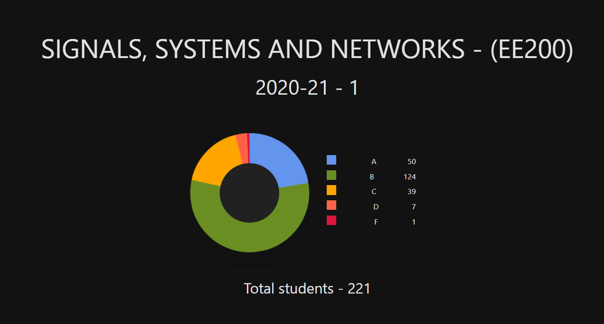

# EE200A - Signals and Systems

I did this course under <a href="https://iitk.ac.in/new/pradip-sircar"><i><b>Prof. Pradip Sircar</b></i></a>. This was the first semester which was ever conducted online. The semester was cut a bit short with respect to the duration. This course is the first course to be done by all students under Electrical Engineering branch.

### Instructor
I would just say that he was a good professor. Since the online module was implemented for the first time, most professors found it difficult to adapt to this new environment, along with him. This brought a major hit in the grading mechanism. He is an aged prof so sometimes he gets confused while explaining some stuff, but he is a highly respected professor in the department due to his contribution and experience. An offline semester with him would have been more interesting.

### Tutors & Tutorials
The instructor did not schedule any tutorials (:thinking: maybe because of it being an online semester) and we never interacted with our tutors. Although, we were encouraged to contact the tutors for clearing doubts, we never felt the need to :stuck_out_tongue_winking_eye:. 

### Books
The instructor's slides were taken from the book <a href="https://www.oxfordpresents.com/ms/mitra/about-the-author/"><i> :green_book: Signals and Systems</i></a> (by Sanjit K. Mitra). The book <i> :blue_book: Signals and Systems</i> (by Alan V. Oppenheim, Alan S. Willsky, and S. Hamid) was also found to be useful by many students (though I never referred any of these books as the slides were sufficient). The <a href="https://ocw.mit.edu/resources/res-6-007-signals-and-systems-spring-2011/"><i>Signals and Systems</i></a> course on MIT OpenCourseWare can also be used as a reference in case you find difficulty understanding some topics and want to try different explainations.

### Pattern of Exam
He conducted 4 Quizzes apart from the Midsem and Endsem. He was a bit stringent on the pattern of the examination. He had a binary policy. We were asked to solve subjective questions, but we only had to submit our final answers, due to which there was no provision for step/partial marking. Despite our numerous requests, he did not change the pattern.

### Lectures & Course Content 
All of our slides can be found <a href="https://drive.google.com/drive/folders/1Q_d99vMyNJetssFmOj5wAFnccl9WKKWk?usp=sharing">here</a>. The course content is very straight-forward and easy. A little amount of time per week on a regular basis can do the work. There are some conventions and definitions to be understood (not rememebered) and the most important and the only major topic is the <i>Laplace Transform</i>. Till Midsem, analog signals are covered while after midsem, digitals signals are taught but all concepts taught in the second half are almost same as the first half, the only difference being that they are applied on digital/discrete signals instead of analog signals. 

### Grading
The cut offs for the grades were not declared but the course average was around 75 out of 100, which shows the simplicity (also maybe cheating took place a lot, who knows :man_shrugging:). You can make your own conclusions after seeing the distribution given below.

Note - The slides which he shared (the ones given above) have mistakes at a number of places. So if you find anything weird or contradictory, cross-verify it from the given book or just google it.