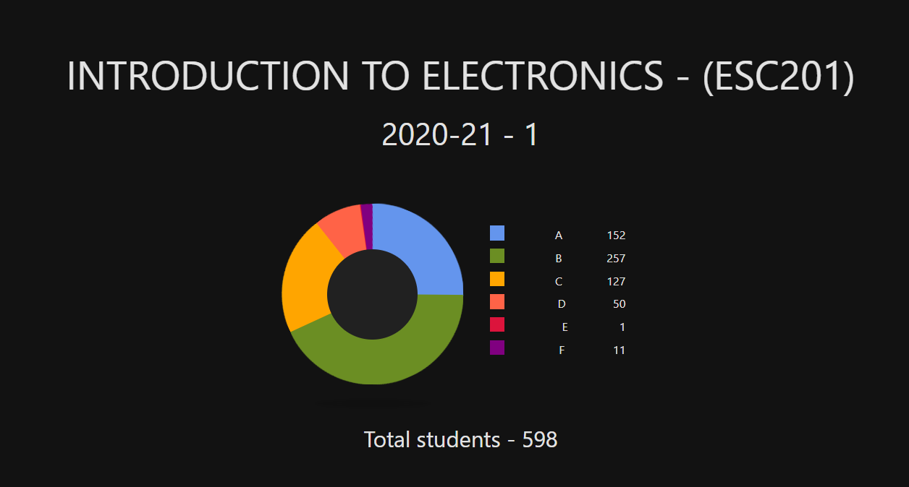

# ESC201A - Introduction To Electronics

I did this course under <a href="https://www.iitk.ac.in/new/baquer-mazhari"><i><b>Prof. Baquer Mazhari</b></i></a>. This is one of those courses which should spark the interest in you towards the branch. It is also a very important course w.r.t to your involvement in core opportunities, be it projects, internships or placements. I am still confused as to why this course is an IC course but <i>it is what it is</i>.

### Instructor
Prof. Mazhari is one the best professors that I have come across till now. He makes you love studying. He managed the online semester so well that I almost never faced any problem with any of his policies. His explainations are very clear and helpful. He is a very student-friendly professor. If you get him as an instructor in any course, you would have a great time.

### Tutors
Regular tutorials were scheduled to discuss assignments which were given beforehand to solve. My tutor was <a href="https://home.iitk.ac.in/~imon/"><i>Prof. Imon Mondal</i></a> and he was also very good in explaining (He told us that in a couple of years, he will also be taking this course as an instructor so if you have him as you instructor then I am sure you will enjoy it). He made the tutorials very interactive and at times, presented some unique alternative to the given questions which made us understand the concept in more depth.

### Books
Prof. Mazhari's slides were more than sufficient for obtaining all the necessary knowledge and understaning of the concepts through examples. The slides were pretty detailed and comprehensive. I never referred to any book for concept understanding as I did not feel the necessity, still if you want, you can practice questions from the books I have in this repo, namely
- <a href="https://drive.google.com/file/d/1NnWzvMWGT2hkRYmxZDKoeFuqoHZAgUSY/view?usp=sharing"><i>Digital principles and applications</i></a> by Albert Paul Malvino
- <a href="https://drive.google.com/file/d/1j1d8vRIhRkoCShSScuB0n-EmD9Vz-TXr/view?usp=sharing"><i>Digital Principles and Logic Design</i></a> by Morris Mano
- <a href="https://drive.google.com/file/d/1JTbnioDGGerRXAu3ggPjNQkDmrXjpJEH/view?usp=sharing"><i>Electronic Devices and Circuit Theory</i></a> by Louis Nashelsky and Robert Boylestad
- <a href="https://drive.google.com/file/d/1XkRY9YdhO8LM_bWW8nrRZggjvp_dt9rK/view?usp=sharing"><i>Engineering Circuit Analysis</i></a> by William H. Hayt, Jack E. Kemmerly & Steve M. Durbin
- <a href="https://drive.google.com/file/d/1SNHJztSb1FhBfDlcedSFN3KVPM4a2I_p/view?usp=sharing"><i>Microelectronic Circuits</i></a> by Adel Sedra and Kenneth C. Smith
- <a href="https://drive.google.com/file/d/13Pn3Aa6FdJIGnacE6qH0nzVfWdSJ-3GN/view?usp=sharing"><i>Opamps and Linear Integrated Circuits</i></a> by Ramakant A. Gayakwad

### Pattern of Examinations
- :page_facing_up: 5 short quizzes in the discussion hours with 1-2 objective (integer type, hence the marking was binary) questions in each quiz. These quizzes were pretty straight-forward and a means to easily increase your overall marks in the course.
- :page_facing_up: 5 short quizzes in the tutorials with 1 subjective question in each quiz. These quizzes were straight-forward too. Since the quizzes were subjective, there was a scope of partial marking.
- :book: 3 Major quizzes with 4-5 questions in each quiz. The questions tested your understanding of the material. 
- :books: Midsem and Endsem (the usual)

### Course Content 
All of our lecture slides can be found <a href="https://drive.google.com/drive/folders/1AVY283TBzOh6xZaaiGloIEmtrhqhjRrf?usp=sharing">here</a>. Slides by <i>Prof. Aloke Dutta</i> has been included in the repo itself.
- The first half of the course consists of the basics and fundamentals of current electricity which we all have studied during our JEE days, like KVL, KCL, RLC circuits, etc. Make sure to gain as many marks as possible in this half as students will be scoring good owing to its ease.
- The second half commences with semi-conductors and the real electronics start there with Diodes, BJTs, MOSFETs and aplications like amplifiers and opamps. 
- Towards the end of the semester, digital electronics will be discussed with a lot of circuit designing.

My advice would be to pay proper attention to the second half. Regularity in the second half is a must. <a href="https://www.youtube.com/playlist?list=PLTFMW-rP7fuqMiK174et4SKbbMKd4VjdU">Click here</a> to head to the playlist containing all his lecture videos. You can also refer to slides by Prof. Aloke Dutta and assignments by Prof. Utpal Das as extra material.

### Grading
The marks distribution was pretty skewed, owing to the large amount of students indulging in unfair means (the peak of the histogram was at 80%-90% bin :no_mouth:). Yet, since there was no proper mechanism to control it, the instructor kept the grading scheme pretty linient. As far as I remember, A grade was given at around 74+%. You can make your own conclusions after seeing the distribution given below.

